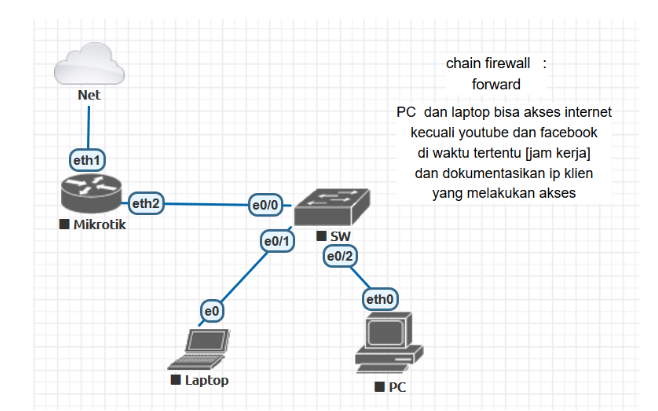
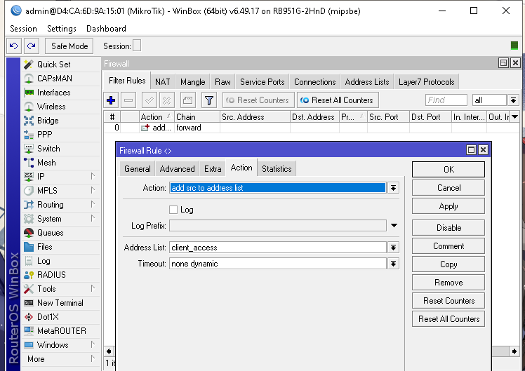
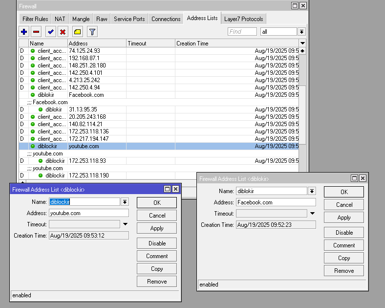
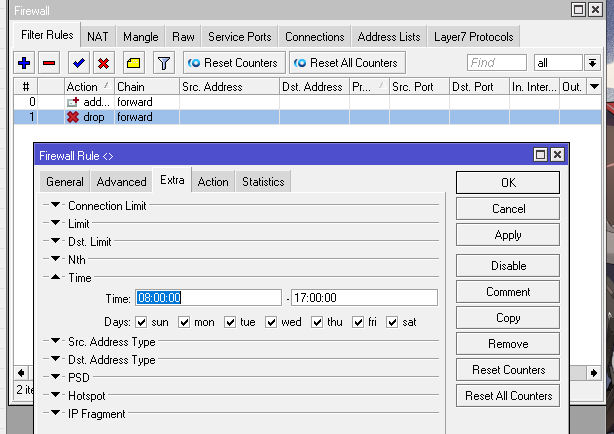
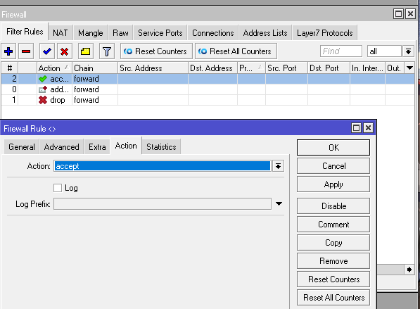

# LAB-24-Firewall-chain-forward-2
tanggal 17 Agustus 2025

# Langkah Konfigurasi Firewall Chain Forward pada Mikrotik

Dengan ketentuan :  

**PC dan Laptop **bisa akses internet**.   
**Kecuali YouTube dan Facebook** (diblokir pada jam kerja tertentu).**  
**IP klien yang mengakses tetap terdokumentasi.**  

---
1. Dokumentasi client, agar setiap client (PC/Laptop) yang akses internet otomatis masuk ke daftar client_access.

2. Sekarang bisa kita lihat di addrest-list untuk yang mengakses internet.
   

4. Tambahkan Address list untuk Facebook dan Youtube. Agar semua IP tujuan Facebook & YouTube masuk ke daftar diblokir.

5. Sekarang kita blokir Facebook & YouTube Saat Jam Kerja.

6. Izinkan Akses Internet Lain di firewall filter rules.

# pengujian   
1. Klien masih bisa akses internet secara umum (Google, email, dll).  
3. Akses YouTube dan Facebook terblokir saat jam kerja.  
4. Log mencatat IP setiap klien yang melakukan request. 
# Kesimpulan

Dengan konfigurasi firewall chain forward, administrator dapat **mengontrol akses situs tertentu**,   
berdasarkan kebutuhan. Rule firewall juga dapat diberi **jadwal waktu**.   
Dokumentasi log sangat penting untuk **memantau aktivitas klien** dan memastikan kebijakan jaringan.    

